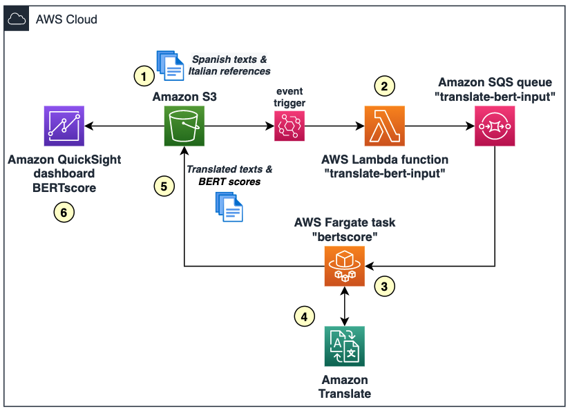

## Evaluating the quality of Amazon Translate's translations with BERTscore

With this example, you will deploy the resources required in AWS for setting up an evaluator of translations from Spanish to Italian done by Amazon Translate, based on the open-source library BERT score (https://github.com/Tiiiger/bert_score).

## Architecture
The evaluator will follow this architecture in high-level:

where we have:
1. Text files uploaded to an Amazon S3 bucket, containing the original text (in Spanish) and the correct/reference translation to compare (in Italian). Note you must use "|" as the field separator, in example:
> Hola|Ciao
> 
> Bienvenido a Italia, amigo|Benvenutto a la Italia, amico
> 
> Hola chico|Ciao ragazzo

2. An AWS Lambda function gets automatically triggered for reading the rows in this file, and sending those as messages to an Amazon SQS queue
3. A container task in Fargate that will be constantly running (until manually stopped) for reading the SQS queue and processing the messages
4. Each message will be translated with Amazon Translate, and evaluated with BERT Score accordingly
5. The results of the processing are stored in another location of the Amazon S3 bucket as CSV files, also with "|" separator, including in example:

| Original text | Reference text | Translated text | BERT score P | BERT score R | BERT score F1 |
| ------------- | -------------- | --------------- |:------------:|:------------:|:-------------:|
|Hola|Ciao|Ciao|1.0000|1.0000|1.0000|
|Bienvenido a Italia, amigo|Benvenutto a la Italia, amico|Benvenuti in Italia, amico|0.8611|0.8259|0.8431|
|Hola chico|Ciao ragazzo|Ciao ragazzo.|0.8643|0.8876|0.8758|

where P: Precision, R: Recall, and F1: F1 score.

6. Finally, an Amazon QuickSight dashboard is created for monitoring the BERTscore obtained for the sample texts. Optionally, you can use Amazon Athena for collecting the output S3 files' information into QuickSight.

## Instructions

### Pre-requisites

You must have an AWS account for deploying this example.

### Deploying the AWS Cloud Formation template

Click on the following button for triggering the deployment of the required infrastructure in your AWS account.

Ireland (eu-west-1) 

This template will provision:
- An Amazon S3 bucket for storing the data
- An AWS Lambda function that will be triggered everytime a new ".txt" file is uploaded to the bucket
- An Amazon SQS queue for temporarily storing the data and passing it for processing
- An Amazon ECS cluster (on AWS Fargate) with its task definition, for processing the data with Amazon Translate and the BERTscore evaluation

Note the Amazon ECS task will not be running yet, it will just be defined at this point.

In the AWS Cloud Formation screen you must input:
- A name for the stack (give it any name you want)
- The image URL for your container. For this you can either:
	- Adjust the Dockerfile included in this repo (folder "translate-bert"), by adding your Amazon S3 bucket name and your Amazon SQS queue URL, build with Docker on your local environment, and push your container to Amazon ECR taking note of the URL provided
	- Or, use the following public image directly: "public.ecr.aws/t0k4y0i8/translate-bert:latest"

## Security

See [CONTRIBUTING](CONTRIBUTING.md#security-issue-notifications) for more information.

## License

This library is licensed under the MIT-0 License. See the LICENSE file.

