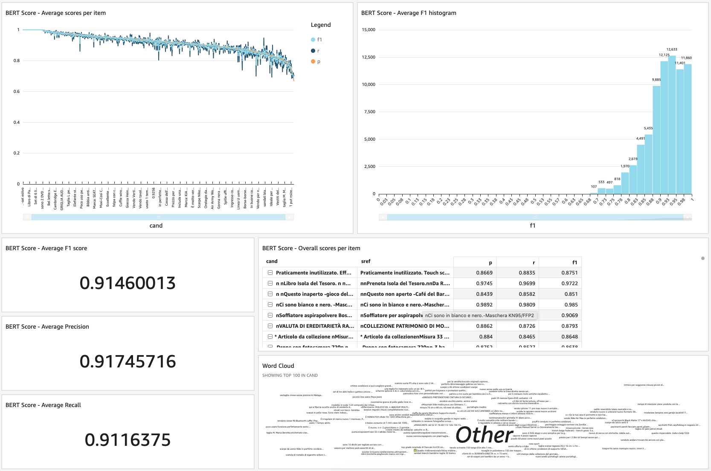

## Evaluating the quality of Amazon Translate's translations with BERTscore

With this example, you will deploy the resources required in AWS for setting up a scalable evaluator of translations from Spanish to Italian done by Amazon Translate, based on the open-source library BERT score (https://github.com/Tiiiger/bert_score).

## Architecture
The evaluator will follow this architecture in high-level:


where we have:
1. Text files uploaded to an Amazon S3 bucket, containing the original text (in Spanish) and the correct/reference translation to compare (in Italian). Note you must use "|" as the field separator, in example:
> Hola|Ciao
> 
> Bienvenido a Italia, amigo|Benvenutto a la Italia, amico
> 
> Hola chico|Ciao ragazzo

2. An AWS Lambda function gets automatically triggered for reading the rows in this file, and sending those as messages to an Amazon SQS queue
3. A container task in Fargate that will be constantly running (until manually stopped) for reading the SQS queue and processing the messages
4. Each message will be translated with Amazon Translate, and evaluated with BERT Score accordingly
5. The results of the processing are stored in another location of the Amazon S3 bucket as CSV files, also with "|" separator, including in example:

| Original text | Reference text | Translated text | BERT score P | BERT score R | BERT score F1 |
| ------------- | -------------- | --------------- |:------------:|:------------:|:-------------:|
|Hola|Ciao|Ciao|1.0000|1.0000|1.0000|
|Bienvenido a Italia, amigo|Benvenutto a la Italia, amico|Benvenuti in Italia, amico|0.8611|0.8259|0.8431|
|Hola chico|Ciao ragazzo|Ciao ragazzo.|0.8643|0.8876|0.8758|

where P: Precision, R: Recall, and F1: F1 score.

6. Finally, an Amazon QuickSight dashboard is created for monitoring the BERTscore obtained for the sample texts. Optionally, you can use Amazon Athena for collecting the output S3 files' information into QuickSight.



Note this architecture is relying in containers and queues for scalability. If your need is just punctual, or just for testing or prototyping purpuses, you can apply the BERTscore e.g. in an Amazon SageMaker notebook for running the evaluation directly in your local data.

## Instructions

### 0. Pre-requisites

You must have an AWS account for deploying this example.

### 1. Deploying the AWS Cloud Formation template

Click on the following button for triggering the deployment of the required infrastructure in your AWS account.

Ireland (eu-west-1) <a href="https://console.aws.amazon.com/cloudformation/home?region=eu-west-1#/stacks/new?stackName=Evaluate-Translate-demo&templateURL=./CloudFormation.yaml" target="_blank"></a>

This template will provision the following resources in your AWS account:
- An Amazon S3 bucket for storing the data
- An AWS Lambda function that will be triggered everytime a new ".txt" file is uploaded to the bucket
- An Amazon SQS queue for temporarily storing the data and passing it for processing
- An Amazon ECS cluster (on AWS Fargate) with its task definition, for processing the data with Amazon Translate and the BERTscore evaluation
- The AWS IAM roles required

Note the Amazon ECS task will not be running yet, it will just be defined.

In the AWS Cloud Formation screen you must input:
- A name for the stack (give it any name you want, e.g. "evaluate-bert-score")
- The Amazon ECR image URL for your container. We will create this image with your details during the next step, so for now just input any text e.g. "dummy"
- A name for the Amazon S3 that will be created. It must be unique, so you can use e.g. "evaluate-bert-score-bucket-<ACCOUNTID>" (replace with your own AWS account ID)


Now click "Next", "Next", go to the end of the page to check the option "I acknowledge that AWS CloudFormation might create IAM resources.", and click on "Create stack".


This should take a few mins to create the resources. You can monitor the progress by updating the status (circle icon) in the "Resources" tab.

Once all resources have status "CREATE_COMPLETE", take note of a couple of parameters that will be needed during the next steps:
- The Amazon S3 bucket name (red rectangle below)
- The Amazon SQS queue URL (red rectangle below)
- The Amazon ECS cluster name (blue rectangle below)


### 2. Creating and registering the BERT Score cluster image

You will now register a Docker container image for running the BERT Score evaluation. For this:

- Open a terminal in your local machine and clone this repository:

````
git clone https://github.com/aws-samples/evaluate-bertscore-amazon-translate/

````

- Access the "translate-bert" folder in the repo

````

cd evaluate-bertscore-amazon-translate/translate-bert
````

- Edit the file "Dockerfile" with a text editor, replacing the following fields with the parameters you got from the previous step:

````
ENV WORKER_SQS_QUEUE_URL="<YOUR SQS QUEUE URL>"
ENV BUCKET_NAME="<YOUR S3 BUCKET NAME>"

````

- (Optional) Edit the script "app.py" and adjust the source and destination languages for your use case. This example comes by default with source in Spanish (slang=es) and destination Italian (dlang=it).

- Build the Docker container by running:
````
docker build -t translate-bert .

````

- Register the container in Amazon ECR following the steps in the documentation here: https://docs.aws.amazon.com/AmazonECR/latest/userguide/docker-push-ecr-image.html

Take note of the URL provided for your image, it should be similar to "public.ecr.aws/XXXXXXXX/translate-bert:latest"

### 3. Edit your task definition and run it

- Go back to your AWS console and access the Amazon ECS Task Definitions screen: https://eu-west-1.console.aws.amazon.com/ecs/home?region=eu-west-1#/taskDefinitions

- Click on your newly created task "evaluate-bert-score-TaskDefinition-XXXXXXXXXXX"

- Select the current revision, then go to "Create new revision"

- Go down to "Container Definitions" and click on the current name, it should be similar to "Bert"

- Replace the parameter "Image" with the container image URL you got in the previous step 


- Click on "Update"

A new revision of your ECS task will be created with the suffix ":2".

- You can now select this revision and go to "Actions", "Run task"

- Select:
	- Launch type: "FARGATE"
	- Cluster VPC: Choose a VPC
	- Sebnets: Choose a subnet. It is important that it has Internet access for allowing the container to communicate with the SQS queue, or alternatively use a VPC Endpoint for SQS
	- Security group: Choose one that allows the communication with SQS

- Click on "Run Task". It should take around 3-5 minutes to instantiate the container and have it ready for service. You will see the status as "Running".

- You can now add any .txt dataset in the bucket, e.g. the one included with this repository "text.txt", and it would process it through the solution. At the end of the process you should have the resulting file "bert-scoreXXXXXXXXXXXXXX.txt" in the bucket including the BERTscore metrics for your translated texts.

## Security

See [CONTRIBUTING](CONTRIBUTING.md#security-issue-notifications) for more information.

## License

This library is licensed under the MIT-0 License. See the LICENSE file.

